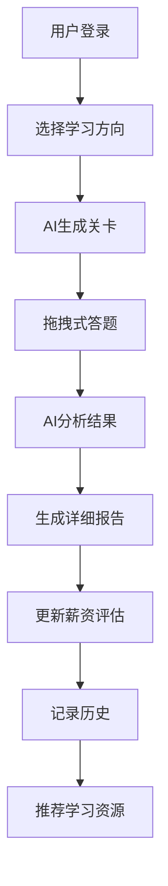

# 程序员技术练兵场

> 作者：[程序员鱼皮](https://yuyuanweb.feishu.cn/wiki/Abldw5WkjidySxkKxU2cQdAtnah)
>
> 本项目为鱼皮全程直播开发的项目！提供完整视频教程 + 文字教程 + 答疑服务，帮你提升项目能力，给简历增加亮点！
>
> ⭐️ 加入项目系列学习：[加入编程导航](https://www.codefather.cn/vip)


## 一、项目介绍

这是一套以 **AI 开发实战 + 全栈技术** 为核心的项目教程，基于 Spring Boot 3 + LangChain4j + Vue 3 开发的程序员技术练兵场平台，通过 AI 智能生成关卡、薪资动态评估、拖拽式答题等创新功能，帮助程序员朋友们提升技术广度和薪资水平！


### 5 大核心功能

1）AI 智能生成关卡：基于用户当前薪资和学习方向，AI 动态生成真实企业场景的技术挑战，支持前端、Java后端、Python后端、软件测试、AI算法、网络运维等多个技术方向。


2）薪资动态评估：根据答题表现实时调整用户薪资，提供精准的技术水平评估和职业发展建议。


3）拖拽式答题：拖拽交互设计，让答题过程更加直观有趣，支持多选技术方案组合。


4）智能结果报告：AI 生成详细的闯关报告，包括分数评价、薪资调整、投递建议、技术解析、架构图、流程图、学习建议和面试题推荐。


5）历史记录追踪：完整记录挑战历史和成长轨迹，支持薪资变化可视化展示。


### 为什么做这个项目？

1）技术热点：AI + 编程是当前最火的赛道，掌握 AI 应用开发技能极具市场价值。

2）实用性强：真实企业场景的技术挑战，帮助程序员快速提升技术广度和面试能力。

3）技术先进：集成最新的 LangChain4j 框架和通义千问大模型，掌握前沿 AI 开发技术。

4）求职利器：项目涵盖多个技术栈，是简历上的亮点项目。


## 二、项目优势

本项目紧跟 AI 时代、选题新颖、技术丰富。区别于传统的增删改查项目，带你实战 AI 智能体开发、前后端全栈技术、创新交互设计等企业级应用场景，大幅提升求职竞争力！

从这个项目中你可以学到：

- 如何利用 AI Vibe Coding 开发包含完整前后端的项目？
- 如何基于 LangChain4j 构建 AI 应用，实现智能关卡生成？
- 如何集成通义千问大模型，实现复杂的 AI 对话和内容生成？
- 如何设计提示词工程，让 AI 生成高质量的技术内容？
- 如何使用 Mermaid 生成系统架构图和流程图？
- 如何集成面试题搜索工具，提供个性化学习建议？


### 鱼皮系列项目优势

鱼皮的原创项目以 **实战** 为主，用 **全程直播** 的方式 **从 0 到 1** 带做，从需求分析、技术选型、项目设计、项目初始化、Demo 编写、前后端开发实现、项目优化、部署上线等，每个环节我都 **从理论到实践** 给大家讲的明明白白、每个细节都不放过！

比起看网上的教程学习，鱼皮项目系列的优势：从学知识 => 实践项目 => 复习笔记 => 项目答疑 => 简历写法 => 面试题解的一条龙服务


编程导航已有 **20 +套项目教程！** 每个项目的学习重点不同，几乎全都是前端 + 后端的 **全栈项目** 。


详细请见：[https://codefather.cn/course](https://www.codefather.cn/course)（在该页面右侧有教程推荐和学习建议）

往期项目介绍视频：[https://bilibili.com/video/BV1YvmbYbEgS](https://www.bilibili.com/video/BV1YvmbYbEgS/)


## 三、技术架构

### 技术栈

**后端技术：**
- Spring Boot 3.5.5 - 现代化 Java 框架
- LangChain4j - AI 应用开发框架
- 通义千问 - 阿里云大语言模型
- MyBatis Plus - 数据库 ORM 框架
- MySQL - 关系型数据库
- Redis - 缓存和会话存储
- Knife4j - API 接口文档

**前端技术：**
- Vue 3 - 渐进式 JavaScript 框架
- Element Plus - Vue 3 组件库
- Vue Router - 路由管理
- Pinia - 状态管理
- Axios - HTTP 客户端
- Vite - 前端构建工具

**AI 相关：**
- LangChain4j Community Dashscope - 通义千问集成
- 提示词工程 - 优化 AI 输出质量
- Tool Calling - AI 工具调用机制


### 核心业务流程




## 四、快速开始

### 环境要求

- JDK 21+
- Node.js 16+
- MySQL 8.0+
- Redis 6.0+
- Maven 3.8+


### 后端启动

1）克隆项目

```bash
git clone https://github.com/liyupi/coder-test.git
cd coder-test
```

2）配置数据库

```bash
# 创建数据库
mysql -u root -p
CREATE DATABASE coder_test;

# 导入数据库表结构
mysql -u root -p coder_test < database/create_tables.sql
```

3）配置 AI 服务

```bash
# 编辑配置文件，填入通义千问 API Key
vim src/main/resources/application.yml
```

4）启动后端服务

```bash
mvn spring-boot:run
```


### 前端启动

1）进入前端目录

```bash
cd coder-test-frontend
```

2）安装依赖

```bash
npm install
```

3）启动开发服务器

```bash
npm run dev
```

4）访问应用

```
http://localhost:5173
```


### API 文档

启动后端服务后，访问 Knife4j 接口文档：
```
http://localhost:8080/doc.html
```


## 五、加入学习

编程导航已有 **20 +套项目教程**！每个项目的学习重点不同，几乎全都是前端 + 后端的 **全栈** 项目 。


欢迎加入 [编程导航](https://www.codefather.cn/vip)，加入后不仅可以全程跟学本项目，往期 20+ 套原创项目教程也都可以无限回看。还能享受更多原创技术资料、学习和求职指导、上百场面试回放视频，开启你的编程起飞之旅~

1 天不到 1 块钱，绝对是对自己最值的投资！PC 网站和 APP 都可以学习。


